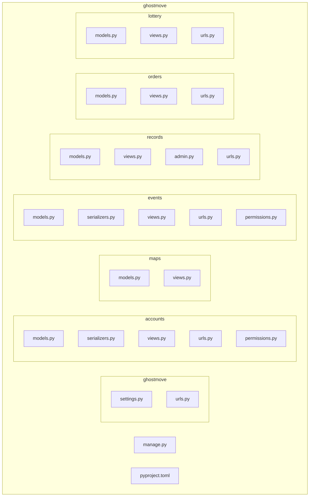

# 幽約地圖
## 一、專案概述

* **幽約地圖**：靈異地圖平台，前端採用 Next.js + React，後端使用 Django + DRF 提供 RESTful API，並以 JWT 保護。
* 功能模組：

  * 使用者帳號（註冊／登入／權限）
  * 地圖標記（故事圖示顯示）
  * 活動報名系統
  * 靈異事件投稿與審核
  * 金流訂單管理
  * 抽獎系統

---

## 二、Software Stack

| 分類   | 技術 / 工具                       | 說明             |
| ---- | ----------------------------- | -------------- |
| 前端   | Next.js + React               | 頁面渲染、CSR／SSR   |
|      | Axios / Fetch                 | API 串接         |
|      | Bootstrap CSS（可選）              | UI 排版          |
| 後端   | Django                        | Web 框架         |
|      | Django REST Framework (DRF)   | 建立 JSON API    |
|      | djangorestframework-simplejwt | JWT 認證         |
|      | django-cors-headers           | 處理 CORS        |
| 資料庫  | SQLite（開發）／MySQL（部署）     | 資料持久化          |
| 安全   | JWT Access/Refresh            | Token-based 驗證 |
|      | 自訂 Permission                 | VIP/管理員角色驗證    |
| 開發工具 | uv + pyproject.toml           | Python 環境與套件管理 |
|      | Git & GitHub                  | 版本控制           |
|      | Postman/Thunder Client        | API 測試         |

---

## 三、目錄結構

```plaintext
ghostmove/                  # 專案根目錄
├── ghostmove/              # 主設定（settings.py / urls.py）
├── manage.py               # 指令入口
├── accounts/               # 用戶系統、JWT、註冊／登入
├── maps/                   # 地圖與標記 API
├── events/                 # 活動報名系統
├── records/                # 靈異事件投稿
├── orders/                 # 金流訂單管理
├── lottery/                # 抽獎系統
└── pyproject.toml          # 套件定義
```

---

## 目錄結構示意圖 (Mermaid)



## 四、常用指令

1. **初始化專案**：

   ```bash
   mkdir ghostmove && cd ghostmove
   uv init
   uv add django djangorestframework djangorestframework-simplejwt django-cors-headers
   ```

2. **建立 Django 專案**：

   ```bash
   uv run django-admin startproject ghostmove .
   ```

3. **建立功能模組 (App)**：

   ```bash
   uv run django-admin startapp accounts
   uv run django-admin startapp maps
   uv run django-admin startapp events
   uv run django-admin startapp records
   uv run django-admin startapp orders
   uv run django-admin startapp lottery
   ```

4. **啟動開發伺服器**：

   ```bash
   uv run python manage.py runserver
   ```

---


