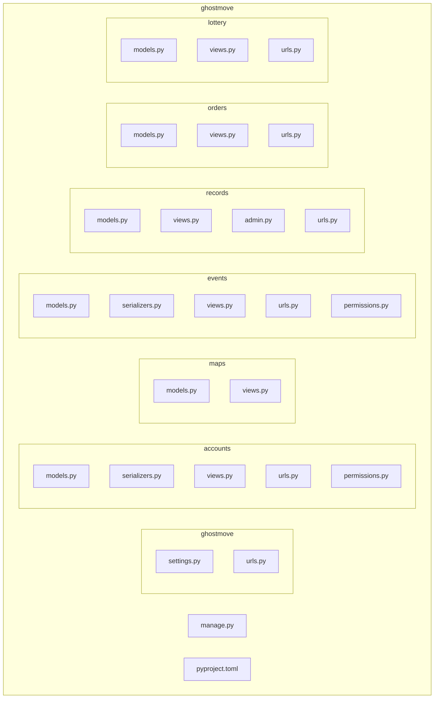

# ghost
# Git 協作規範

為了維持團隊開發流程順暢，建議採用以下 Git 協作規範：

1. **分支策略 (Git Flow)**
   - `main`：部署到生產環境的穩定分支。
   - `develop`：開發整合分支，所有功能完成功能分支合併到此。
   - `feature/xxx`：新功能分支，命名格式：`feature/功能名稱`。
   - `release/xxx`：版本釋出準備分支，命名格式：`release/vX.Y.Z`。
   - `hotfix/xxx`：緊急修復分支，命名格式：`hotfix/描述`。

2. **提交訊息格式**
   - 採用 Conventional Commits 規範：
     ```
     <type>(<scope>): <內容>
     ```
     - `type`：`feat`、`fix`、`docs`、`chore`、`refactor`、`test`。
     - `scope`：影響的模組或範圍，如 `accounts`、`maps`。
     - `內容`：簡短描述，例如 `feat(accounts): add JWT login endpoint`。

3. **Pull Request 要求**
   - 每個 PR 需指定 Reviewer（至少一位團隊成員）。
   - PR 標題需符合提交訊息格式。
   - PR 描述需包含：
     - 變更背景 (Why)
     - 變更內容 (What)
     - 部署或測試注意事項 (How)

4. **Code Review 規範**
   - 嚴格檢查功能是否符合需求。
   - 檢查程式風格與一致性 (PEP8 / ESLint)。
   - 測試覆蓋必要的邏輯，確保無破壞既有功能。

5. **合併流程**
   - Feature 分支完成後，發起 PR 合併至 `develop`。
   - Release 分支完成測試後，合併至 `main`，並打 tag。
   - Hotfix 分支合併至 `main`，同時回推至 `develop`。

6. **定期維護**
   - 每週或每次迭代結束後，清理已合併的分支。
   - 定期更新第三方相依套件並回報團隊。

7. **指派 Reviewers 方法**
   - 在 PR 頁面右側，找到 **Reviewers** 欄位。
   - 點擊下拉選單，輸入並選擇 GitHub 使用者或團隊名稱。
   - 被指派者會收到通知，並出現在 PR 標頭。


## 一、專案概述

* **GhostMove**：靈異地圖平台，前端採用 Next.js + React，後端使用 Django + DRF 提供 RESTful API，並以 JWT 保護。
* 功能模組：

  * 使用者帳號（註冊／登入／權限）
  * 地圖標記（故事圖示顯示）
  * 活動報名系統
  * 靈異事件投稿與審核
  * 金流訂單管理
  * 抽獎系統

---

## 二、Software Stack

| 分類   | 技術 / 工具                       | 說明             |
| ---- | ----------------------------- | -------------- |
| 前端   | Next.js + React               | 頁面渲染、CSR／SSR   |
|      | Axios / Fetch                 | API 串接         |
|      | Tailwind CSS（可選）              | UI 排版          |
| 後端   | Django                        | Web 框架         |
|      | Django REST Framework (DRF)   | 建立 JSON API    |
|      | djangorestframework-simplejwt | JWT 認證         |
|      | django-cors-headers           | 處理 CORS        |
| 資料庫  | SQLite（開發）／MySQL（部署）     | 資料持久化          |
| 安全   | JWT Access/Refresh            | Token-based 驗證 |
|      | 自訂 Permission                 | VIP/管理員角色驗證    |
| 開發工具 | uv + pyproject.toml           | Python 環境與套件管理 |
|      | Git & GitHub                  | 版本控制           |
|      | Postman/Thunder Client        | API 測試         |

---

## 三、目錄結構

```plaintext
ghostmove/                  # 專案根目錄
├── ghostmove/              # 主設定（settings.py / urls.py）
├── manage.py               # 指令入口
├── accounts/               # 用戶系統、JWT、註冊／登入
├── maps/                   # 地圖與標記 API
├── events/                 # 活動報名系統
├── records/                # 靈異事件投稿
├── orders/                 # 金流訂單管理
├── lottery/                # 抽獎系統
└── pyproject.toml          # 套件定義
```

---

## 目錄結構示意圖 (Mermaid)



## 四、常用指令

1. **初始化專案**：

   ```bash
   mkdir ghostmove && cd ghostmove
   uv init
   uv add django djangorestframework djangorestframework-simplejwt django-cors-headers
   ```

2. **建立 Django 專案**：

   ```bash
   uv run django-admin startproject ghostmove .
   ```

3. **建立功能模組 (App)**：

   ```bash
   uv run django-admin startapp accounts
   uv run django-admin startapp maps
   uv run django-admin startapp events
   uv run django-admin startapp records
   uv run django-admin startapp orders
   uv run django-admin startapp lottery
   ```

4. **啟動開發伺服器**：

   ```bash
   uv run python manage.py runserver
   ```

---

## 五、JWT & CORS 範例設定

### settings.py

```python
INSTALLED_APPS = [
    ...,
    'rest_framework',
    'rest_framework_simplejwt',
    'corsheaders',
    'accounts', 'maps', 'events', 'records', 'orders', 'lottery',
]
MIDDLEWARE = [
    'corsheaders.middleware.CorsMiddleware',
    ...
]
REST_FRAMEWORK = {
    'DEFAULT_AUTHENTICATION_CLASSES': (
        'rest_framework_simplejwt.authentication.JWTAuthentication',
    ),
}
CORS_ALLOWED_ORIGINS = [
    'http://localhost:3000',
]
```

### urls.py

```python
from django.urls import path, include
from rest_framework_simplejwt.views import TokenObtainPairView, TokenRefreshView

urlpatterns = [
    path('api/token/', TokenObtainPairView.as_view(), name='token_obtain_pair'),
    path('api/token/refresh/', TokenRefreshView.as_view(), name='token_refresh'),
    path('api/accounts/', include('accounts.urls')),
    path('api/maps/', include('maps.urls')),
    # ... 其他 app
]
```

---

